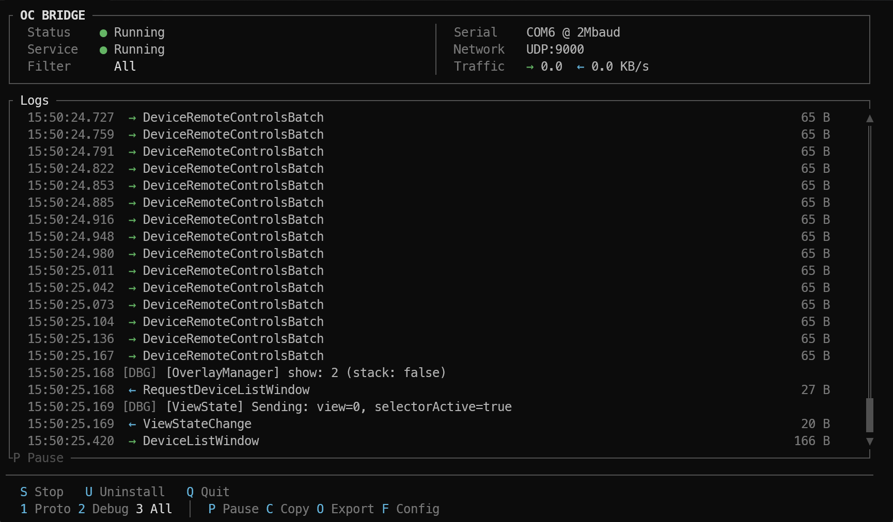

# Open Control Bridge

Serial-to-UDP bridge for high-bandwidth communication between hardware controllers and DAW extensions.



## Why Not MIDI SysEx?

| | MIDI SysEx | USB Serial + UDP |
|---|---|---|
| Bandwidth | ~31.25 kbit/s | Full USB speed (480 Mbit/s) |
| Encoding | 7-bit (overhead) | 8-bit native |
| Latency | ~10-50ms | ~2-3ms |
| Reliability | Lossy under load | Reliable |

MIDI SysEx was designed for patch dumps, not real-time bidirectional communication. The bridge bypasses MIDI entirely using direct USB serial, enabling features like live parameter feedback, waveform displays, and responsive UI updates.

## Architecture

```
┌──────────────┐    USB Serial     ┌────────────┐      UDP       ┌─────────────┐
│   Teensy     │◄─────────────────►│  oc-bridge │◄──────────────►│   Bitwig    │
│  Controller  │   COBS framing    │            │   :9000        │  Extension  │
└──────────────┘                   └────────────┘                └─────────────┘
```

Messages are defined using [protocol-codegen](https://github.com/open-control/protocol-codegen), which generates type-safe C++ (Teensy) and Java (Bitwig) code from Python definitions.

## Quick Start

### Download

Prebuilt binaries available in [Releases](https://github.com/open-control/bridge/releases):
- `oc-bridge-windows.exe`
- `oc-bridge-linux`

### Run

```bash
# Run the daemon (single instance, per-user config)
oc-bridge --daemon

# Launch the TUI client (monitors a running daemon)
oc-bridge

# Headless dev mode (no TUI)
oc-bridge --headless --controller websocket

# Override serial + host UDP ports
oc-bridge --daemon --port COM3 --udp-port 9000
```

### TUI Controls

| Key | Action |
|-----|--------|
| `B` | Serial: Release / Attach (pause/resume) |
| `1` `2` `3` | Filter: Protocol / Debug / All |
| `P` | Logs: Freeze / Follow (UI only) |
| `C` | Copy filtered logs |
| `X` | Cut (copy + clear) |
| `Backspace` | Clear logs |
| `E` | Export filtered logs |
| `F` | Open config |
| `Q` / `Esc` | Quit |

Debug filter shortcuts (only when Filter = Debug):

- `D`: show DEBUG
- `W`: show WARN
- `R`: show ERROR
- `A`: show all levels

### Autostart (End-User)

For end-user releases, `oc-bridge` is intended to be started and supervised by `ms-manager`
(tray/background). `oc-bridge` does not install OS services.

### Local Control (Pause/Resume/Status)

To allow firmware flashing without stopping the whole bridge process, `oc-bridge` exposes a
minimal local control plane.

- Binds to `127.0.0.1` only
- Default port: `7999`

```bash
# Query status
oc-bridge ctl status

# Connectivity check
oc-bridge ctl ping

# Daemon info (pid/version/config/ports)
oc-bridge ctl info

# Temporarily release the serial port
oc-bridge ctl pause

# Resume normal operation
oc-bridge ctl resume

# Ask the daemon to exit
oc-bridge ctl shutdown

# Override port
oc-bridge ctl --control-port 7999 status
```

## Configuration

Config file: per-user `config.toml` in the platform config directory:

- Windows: `%APPDATA%\OpenControl\oc-bridge\config.toml`
- macOS: `~/Library/Application Support/OpenControl/oc-bridge/config.toml`
- Linux: `$XDG_CONFIG_HOME/opencontrol/oc-bridge/config.toml` (or `~/.config/opencontrol/oc-bridge/config.toml`)

```toml
[bridge]
controller_transport = "serial"
serial_port = ""        # Empty = auto-detect via device_preset
device_preset = "teensy"

host_transport = "udp"
host_udp_port = 9000

log_broadcast_port = 9999

# Local control plane (127.0.0.1)
control_port = 7999

[logs]
max_entries = 200
export_max = 2000

# Persistent file logs (rotating)
file_enabled = true
file_max_bytes = 5000000
file_max_files = 3
file_flush_ms = 250
file_include_protocol = false
file_include_debug = true
file_include_system = true

[ui]
default_filter = "All"  # "Protocol", "Debug", or "All"
```

When enabled, file logs are written as `bridge.log` (plus `bridge.log.1..N`) next to `config.toml`.

## Build from Source

### Prerequisites

- [Rust](https://rustup.rs/) (stable)

### Build

```bash
cargo build --release
```

Binary: `target/release/oc-bridge` (or `.exe` on Windows)

### Cross-compilation

```bash
# Linux → Windows (requires mingw-w64)
rustup target add x86_64-pc-windows-gnu
cargo build --release --target x86_64-pc-windows-gnu
```

## Protocol Integration

The bridge is protocol-agnostic. Message encoding/decoding is handled by code generated from [protocol-codegen](https://github.com/open-control/protocol-codegen):

1. Define messages in Python
2. Generate C++ (Teensy) + Java (Bitwig)
3. Bridge transparently forwards COBS frames ↔ UDP datagrams

## License

MIT
